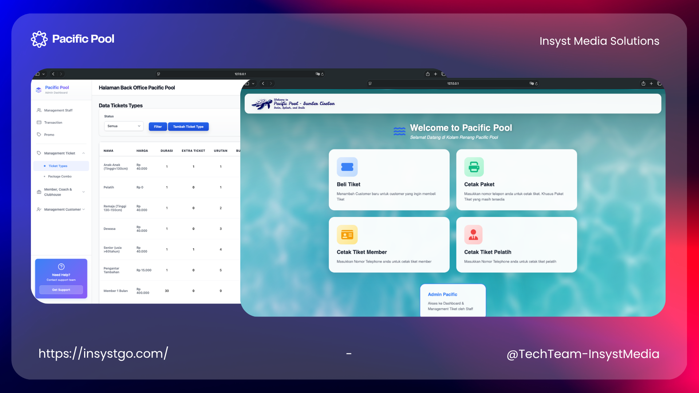

# Pacific Pool - Ticketing Management

The Digital Ticketing and Membership Management System developed for Pacific Pool, a prominent leisure facility in Submer District, Cirebon Regency, West Java, Indonesia, is a comprehensive solution engineered to digitize and streamline core business processes. The system encompasses public ticket sales, membership lifecycle management, centralized back-office administration, and real-time transaction tracking. It is divided into two key modules: the Front Office (Point-of-Sale / POS) Operations and the Back Office (Centralized Management).

The Front Office serves as the primary transaction interface, dedicated to fast and accurate customer service. It facilitates ticket and package sales, new sign-ups, membership and coach renewal payments, and the redemption of pre-purchased packages or digital tickets, supporting the printing of physical tickets and official transaction receipts. For security, the payment flow requires a mandatory staff PIN validation step after the customer selects their payment method to confirm and finalize the transaction.

The Back Office acts as the centralized administrative hub for deep data management and business intelligence. It is built on an efficient, modern interactive Single-Page Application (SPA) framework, which provides a seamless, one-page user experience for all administrative tasks, maximizing operational efficiency. This module delivers full CRUD (Create, Read, Update, Delete) capabilities across essential business entities, including: Customer & Member Management, Staff Management (roles and credentials), Transaction Management (review and auditing), Promotional Management, Inventory Management (ticket types and pricing structures), and dedicated Coach & Clubhouse Management.

## Tech Stack

**Client:** Laravel, Vite, TailwindCSS

**Database:** MySQL 

